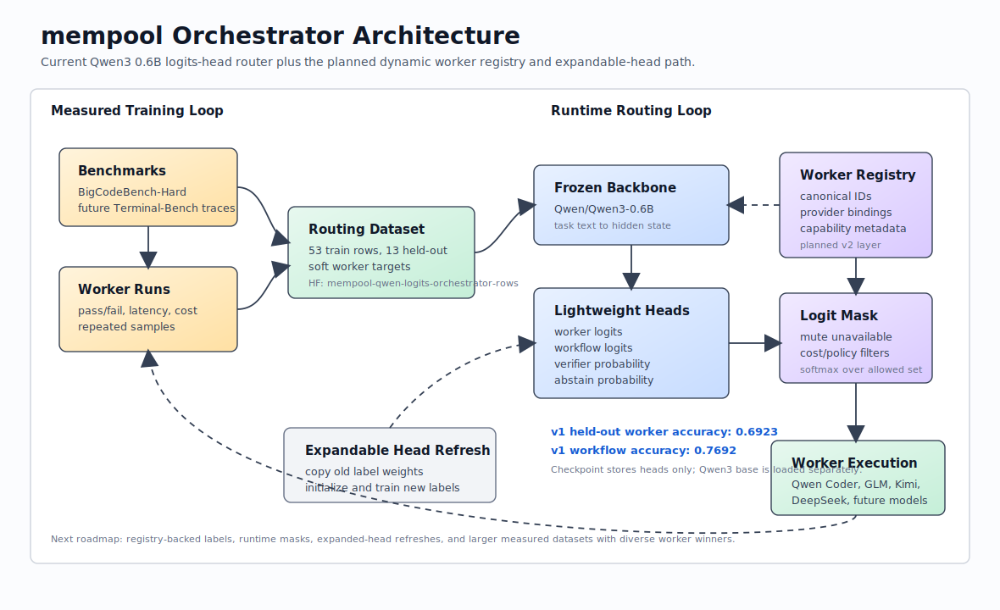

# mempool

`mempool` is an open research project for learned model orchestration.

The goal is to build a small, auditable coordinator that can decide how to route,
compose, verify, and improve work across a pool of capable agents or models. The
system should be independent, reproducible, and measurable: every orchestration
decision should leave enough evidence for later analysis.

The worker pool is intentionally open-ended. It should support top-tier hosted
models, strong open-weight models, specialist local models, tool-using agents,
and future systems through the same interface.

## Architecture



The current architecture is intentionally compact:

1. Benchmark and worker runs produce measured outcome rows.
2. Rows are converted into soft routing targets.
3. A frozen Qwen3 0.6B backbone embeds task text.
4. Lightweight heads emit worker logits, workflow logits, verifier probability,
   and abstain probability.
5. Runtime routes to the selected worker pool.

The next architecture step is registry-backed routing. Worker IDs should become
canonical model identities, while provider-specific names remain runtime
bindings. A mask layer will let the router mute unavailable, deprecated,
expensive, or user-disallowed workers before softmax.

## Direction

- Learn routing policies from task outcomes, not fixed hand-written rules.
- Support query-adaptive workflows: direct answer, routed answer, parallel
  comparison, verifier pass, or multi-step decomposition.
- Track quality, latency, cost, uncertainty, and provenance for every run.
- Make frontier-capable workers usable without hard-coding the project around
  any one provider.
- Keep research loops bounded so autonomous experiments produce reviewable diffs
  and comparable metrics.
- Prefer transparent evaluation over benchmark theater.

## Repository Layout

- `src/` - implementation code.
- `tools/` - local scripts for data prep, evaluation, and experiment control.
- `docs/` - project-facing design notes and architecture.
- `research/` - ideas, experiments, evals, and run logs.
- `literature/` - paper notes, surveys, and outside context.
- `external_repos/` - third-party references, kept out of the core project.

## What This Offers

`mempool` now contains a usable Qwen3-based orchestration checkpoint:

- A small Qwen-family coordinator representation.
- Trained routing heads for worker selection, workflow selection, verifier
  probability, and abstain/fallback probability.
- A deterministic train/held-out split over measured BigCodeBench-Hard routing
  rows.
- A CLI that can route new task text into worker/workflow probabilities.
- Reproducible local, Apple MPS, CUDA, and Lightning AI training launch paths.
- Published Hugging Face dataset/model artifacts.

Published artifacts and local checkpoints:

| Artifact | Location |
| --- | --- |
| Training rows | [blazeofchi/mempool-qwen-logits-orchestrator-rows](https://huggingface.co/datasets/blazeofchi/mempool-qwen-logits-orchestrator-rows) |
| Qwen3 0.6B model v1 | [blazeofchi/mempool-qwen3-0p6b-logits-orchestrator-v1](https://huggingface.co/blazeofchi/mempool-qwen3-0p6b-logits-orchestrator-v1) |
| Qwen2.5 model v0 | [blazeofchi/mempool-qwen-logits-orchestrator-v0](https://huggingface.co/blazeofchi/mempool-qwen-logits-orchestrator-v0) |
| v1 local checkpoint | `research/models/20260628-qwen3-0p6b-logits-orchestrator-full-gpu-l40s/qwen_logits_heads.pt` |
| v0 local checkpoint | `research/models/20260628-qwen-small-logits-orchestrator-full-gpu-l40s/qwen_logits_heads.pt` |

The v1 model stores only the trained routing heads. It uses
`Qwen/Qwen3-0.6B` as the frozen base model and attaches lightweight
heads at inference time.

## Current Results

The repository now has an end-to-end measured-data loop:

1. Ollama/OpenAI-compatible worker evaluation.
2. BigCodeBench-Hard task materialization and executable evaluation.
3. Repeated outcome JSONL collection.
4. Routing dataset conversion with worker rewards and soft targets.
5. Lightweight logits-router training and promotion gates.
6. Multi-head task-level orchestrator substrate export.
7. A trained local multi-head orchestrator candidate.
8. Qwen 0.6B logits-head orchestrator training and prediction.
9. Adaptive refresh records with quarantine/rollback discipline.

The current Qwen3 0.6B v1 orchestrator artifact is:

```text
research/models/20260628-qwen3-0p6b-logits-orchestrator-full-gpu-l40s/qwen_logits_heads.pt
```

It was trained for 40 epochs on a Lightning AI L40S GPU over 53 train rows and evaluated on 13
held-out rows:

| Split | Worker Accuracy | Workflow Accuracy | Mean Worker Loss | Mean Workflow Loss |
| --- | ---: | ---: | ---: | ---: |
| train | 0.8113 | 0.8868 | 1.2074 | 0.2335 |
| held-out | 0.6923 | 0.7692 | 1.3019 | 0.6372 |

The earlier one-epoch split smoke reached 0.3077 held-out worker accuracy, and
the 20-epoch Apple MPS run reached 0.3846. The Qwen2.5 L40S v0 reached 0.5385;
the Qwen3 0.6B L40S v1 improves this to 0.6923, but it is still small-data and
not a production policy.

Release lineage:

| Release | Backbone | Train Rows | Held-out Rows | Train Worker Acc. | Held-out Worker Acc. | Status |
| --- | --- | ---: | ---: | ---: | ---: | --- |
| E0 split smoke | `Qwen/Qwen2.5-0.5B-Instruct` | 53 | 13 | 0.4717 | 0.3077 | proof of held-out gate |
| v0 full GPU | `Qwen/Qwen2.5-0.5B-Instruct` | 53 | 13 | 0.7358 | 0.5385 | first published checkpoint |
| v1 full GPU | `Qwen/Qwen3-0.6B` | 53 | 13 | 0.8113 | 0.6923 | current checkpoint |

The source split is:

```text
research/datasets/20260628-qwen-small-logits-orchestrator-split-train.jsonl
research/datasets/20260628-qwen-small-logits-orchestrator-split-heldout.jsonl
research/datasets/20260628-qwen-small-logits-orchestrator-split-manifest.json
```

## Use The Orchestrator

Create a Python 3.11 or 3.12 environment with the training extras:

```bash
python3.12 -m venv .venv-qwen-train
source .venv-qwen-train/bin/activate
python3 -m pip install -e '.[qwen-train]'
```

Route a task with the v1 checkpoint:

```bash
PYTHONPATH=src python3 tools/predict_qwen_logits_orchestrator.py \
  --checkpoint research/models/20260628-qwen3-0p6b-logits-orchestrator-full-gpu-l40s/qwen_logits_heads.pt \
  --text "Write Python code to scrape the first HTML table from a URL into a pandas DataFrame."
```

Example output includes:

```text
predicted_worker_id: ollama-cloud-qwen3-coder-480b
predicted_workflow: direct
verifier_probability: 0.6475
```

Train and evaluate a full local/MPS/CUDA run:

```bash
PYTHONPATH=src python3 tools/run_qwen_full_orchestrator.py \
  --epochs 20 \
  --batch-size 4 \
  --device auto \
  --output-dir research/models/local-qwen-full \
  --plan-output research/models/local-qwen-full-plan.json
```

Submit the same run to Lightning AI after setting `LIGHTNING_USER_ID` and
`LIGHTNING_API_KEY` in your shell:

```bash
python3 -m venv .venv-lightning
.venv-lightning/bin/python -m pip install -U pip lightning-sdk
.venv-lightning/bin/python tools/submit_lightning_qwen_full_run.py \
  --machine L40S \
  --epochs 40
```

Machine availability depends on the selected Lightning teamspace/cloud account.
On the first attempt for this project, `L4`, `T4`, and `A100` batch jobs were
rejected by the selected AWS cluster even though the global machine list showed
those names. The GPU releases were trained through a Lightning Studio on `L40S`;
use the Studio UI or a matching cloud account if batch submission reports
`accelerator ... not found`.

To check the current machine:

```bash
PYTHONPATH=src python3 tools/audit_qwen_training_readiness.py \
  --output research/models/local-qwen-training-readiness.json
```

Prepare Hugging Face upload folders:

```bash
PYTHONPATH=src python3 tools/prepare_hf_release.py
```

After `hf auth login`, publish the dataset and model repos:

```bash
PYTHONPATH=src python3 tools/publish_hf_release.py
```

For bounded autonomous improvement runs, see
`.agents/skills/research-loop/SKILL.md` and
`research/programs/orchestration_loop.md`.

## Roadmap

Near-term roadmap:

- **Dynamic worker registry:** replace provider-shaped labels with canonical
  worker IDs, provider bindings, model metadata, cost/latency priors, and
  availability flags.
- **Runtime logit masking:** allow unavailable, muted, deprecated, or
  user-disallowed workers to be removed from the softmax decision at inference
  time.
- **Expandable heads:** refresh a worker head when new models arrive by copying
  old label weights, initializing new labels, collecting measured outcomes, and
  promoting only when held-out routing improves.
- **Model-conditioned scoring:** prototype a router that scores task
  representations against worker metadata so new models can generalize faster
  than flat label heads.
- **Dataset expansion:** audit public per-sample model outcome datasets first;
  fill gaps with screened BigCodeBench runs and repeated top-k worker
  comparisons only where tasks can produce useful positive or disagreement
  signal.
- **Next training run:** train a stronger vNext only after the dynamic-head path
  exists or the dataset has enough new empirical winner diversity to justify a
  fair comparison against Qwen3 v1.

## Quick Commands

```bash
PYTHONPATH=src python3 -m unittest discover tests
PYTHONPATH=src python3 tools/train_multi_head_orchestrator.py \
  --substrate research/datasets/20260628-m5-current-task-66task-substrate.jsonl \
  --model-output research/models/local-multihead.json \
  --report-output research/evals/local-multihead-report.json
PYTHONPATH=src python3 tools/train_qwen_logits_orchestrator.py \
  --plan-output research/models/local-qwen-logits-plan.json \
  --rows-output research/datasets/local-qwen-logits-rows.jsonl
PYTHONPATH=src python3 tools/audit_qwen_training_readiness.py
```
